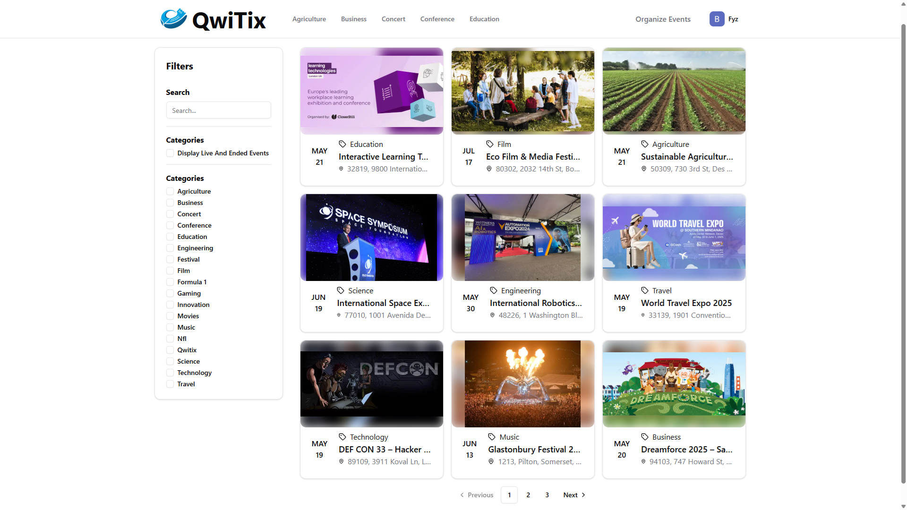
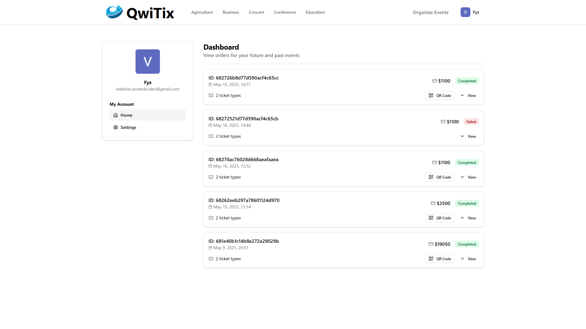
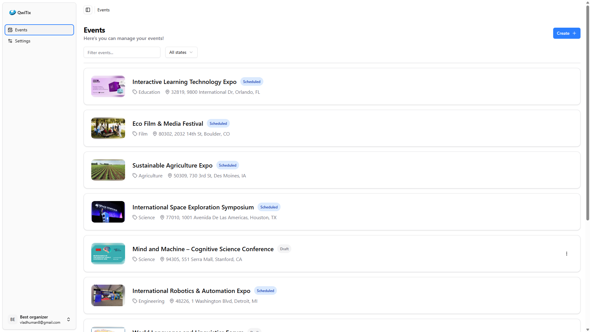
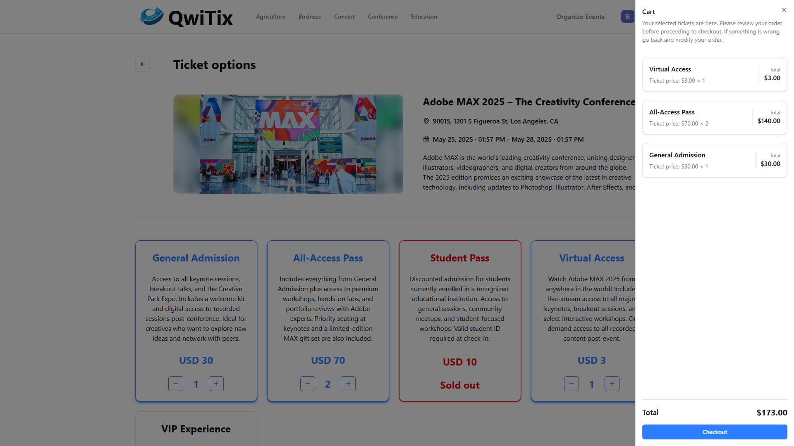

<table>
  <tr>
    <td width='1200px' height='150px' align="center">
      <div display="">
        
        <h1><strong>Qwitix-web</strong></h1>
      </div>
    </td>
  </tr>

<tr>
 <td>
  <p align='center'>
    
    
    
    
    
    
    
    
  </p>
 </td>
</tr>
</table>

## 📝 Description

**Qwitix Web** is the client-side application for the Qwitix platform — a service for browsing, selecting, and purchasing event tickets. It was developed as part of a **first-year university course project**, following modern frontend standards, best practices, and clean architecture.

### 🔧 Key Features & Technologies

- ⚛️ **Next.js** as the main React framework for SSR and fast performance  
- 🟦 Written entirely in **TypeScript** for type safety and developer experience  
- 🎨 Styled with **Tailwind CSS** for utility-first UI building  
- 💅 Uses **ShadCN UI** for beautiful and accessible component styling  
- 📦 **Zustand** for minimal and scalable global state management  
- ✅ **Zod** for schema-based form and data validation  
- 🔗 **Swagger TypeScript API generation** to auto-generate fully-typed API clients from backend docs  
- 🔄 Fully typed interaction with Qwitix API using OpenAPI-generated TypeScript clients
- 📃 Implements infinite scroll and pagination across various pages for optimal data loading experience
- 💡 Clear code separation and modular structure for scalability and maintainability
- 🚀 **Deployed to an Azure Virtual Machine**

> 📦 For more details about deployment and infrastructure setup, see the [**Qwitix-Infra**](https://github.com/Fyz-dev/qwitix-infra) repository.

## 📸 Preview
<table>
  <tr>
    <td>
      
    </td>
    <td>
      
    </td>
  </tr>
  <tr>
    <td>
      
    </td>
    <td>
      
    </td>
  </tr>
</table>

## 🔧Installation

1. Cloning the repository

```bash
https://github.com/Fyz-dev/qwitix-web.git
```

2. Environment setup
   
Duplicate the example environment file and fill in all required variables.
```bash
cp .env.example .env
```
Open .env in your favorite editor and provide the necessary configuration values (e.g. database connection string, Stripe keys, Azure credentials, JWT secrets, etc.).

3. ▶️ Run with Docker (recommended for production-like environment)
   
Once the .env file is configured, you can spin up the entire environment.
```bash
docker compose --env-file .env up
```

4. ▶️ Run locally (for development)
   
Install dependencies and start the development server.
```bash
pnpm install
pnpm dev
```
5. [Optional] Generate API types from backend (OpenAPI)

If the backend Swagger schema is available, you can auto-generate fully typed API clients.
```bash
pnpm gen:type
```
> 🔧 Generation is configured via the [gen-script.ts](/src/gen-script.ts) file.
> 
> 📄 The URL or path to the OpenAPI schema is taken from the .env file — make sure to set the API_SWAGGER_URL variable correctly.

6. 📦 That’s it!
